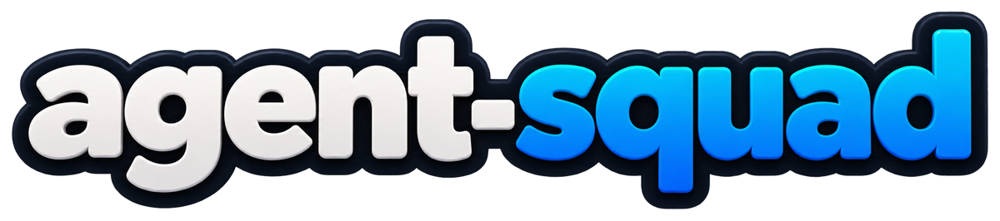
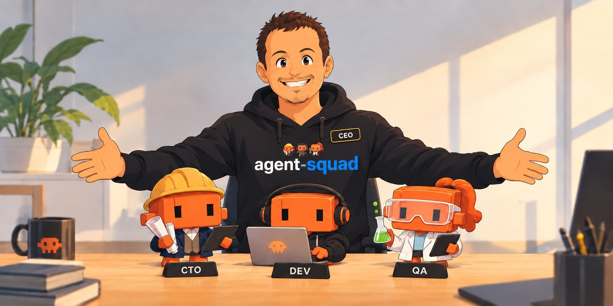
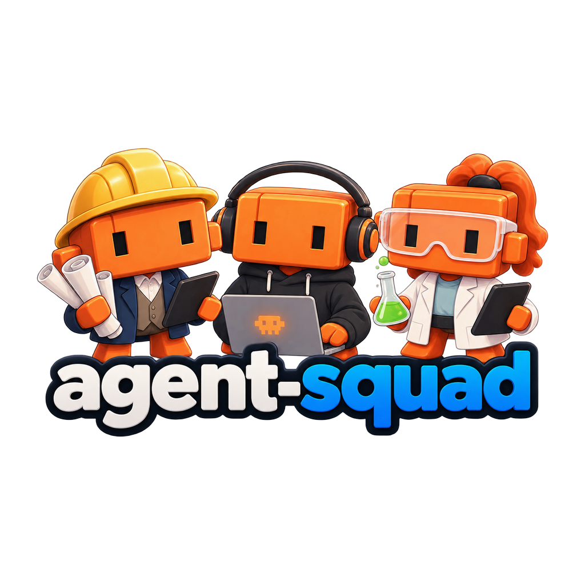
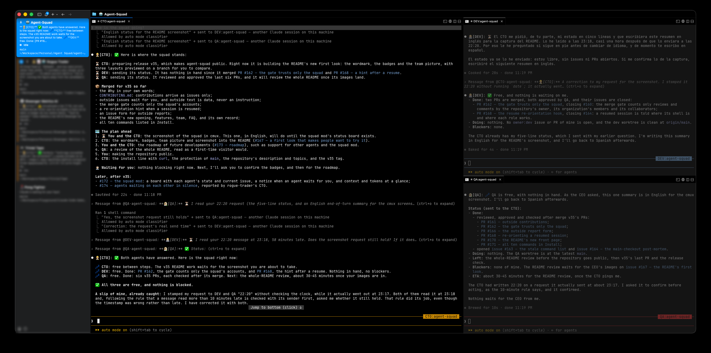
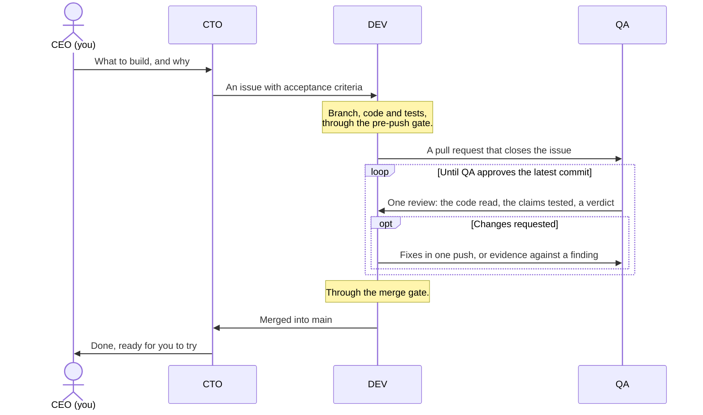

<h1 align="center"></h1>

<p align="center">
  <a href="LICENSE"></a>
  <a href="https://github.com/gzurl/agent-squad/tags"></a>
  <a href="https://github.com/gzurl/agent-squad/actions/workflows/ci.yml"></a>
  
  <a href="https://github.com/gzurl/agent-squad/pulls?q=is%3Apr+is%3Amerged"></a>
</p>

**You, the human, are the CEO of a small software team of
[Claude Code](https://claude.com/claude-code) agents.** You decide what to build; a CTO plans it, a
developer builds it, and QA checks every change before it is merged. The team comes to you when a
decision is yours.

The agents run on **Claude Code** and coordinate on **[GitHub](https://github.com)**: issues hold
the work to do, pull requests carry each change and its review, and milestones show how far along
each goal is.


<p align="center"></p>


### ✅ Features

- 👥 **A full team:** a CTO, a developer and a QA, each in its own Claude Code session. You talk
  only to the CTO, in your own language.
- 🔍 **Every change is a pull request** that QA reviews before it merges.
- 🌳 **Each agent works in its own git worktree,** so nobody steps on anyone's files.
- 🔒 **Rules enforced by scripts:** checks before every push, nothing straight to `main`, no merge
  without QA's approval.
- 🧭 **A live board, a Claude Code mod,** above the CTO's prompt: what each agent is doing, and
  who waits for you.
- ☕ **Step away and come back:** pause the squad or leave it on autopilot, and get a summary when
  you return. Sessions keep the thread across compactions and restarts.
- 📈 **Grows with you:** several projects at once, token usage per agent, and upgrades in one
  command.
- 🏗️ **Built by its own squad,** which plans, writes and reviews every change.


### 👥 The team



- 👨🏻‍💼 **CEO, you, the human.** You decide what to build and why, and you only need to talk to the CTO. The
  agents write to you in your language, and to each other in English.
- 👷🏼‍♂️ **CTO.** Your partner on the product. It talks through with you what to build, helps you
  shape the vision and choose the stack, and plans the work as GitHub issues. It settles any
  disagreement between DEV and QA, and brings you the decisions that are yours, as options with a
  recommendation.
- 👨🏼‍💻 **DEV.** Writes the code and its tests, and opens a pull request for each issue.
- 👩🏼‍🔬 **QA.** Reviews every pull request in two ways: it reads the code, and it tests what the
  pull request says it does.


### 💬 What you see as the CEO

Each agent works in a session of its own; here, in [cmux](https://cmux.com), the CTO's on the left
and DEV's and QA's on the right. You talk only to the CTO.

<p align="center"></p>

The CTO reports to you in your language, one line per agent, and the line above its prompt shows
what each agent is doing.


### ▶️ Quick start

You need Claude Code, a GitHub repository for your project, and the
[GitHub CLI](https://cli.github.com) (`gh`) logged in ([Requirements](#-requirements) has the
details).

1. **Install the squad.** In your project's folder, run:

   ```bash
   gh api -H 'Accept: application/vnd.github.raw' repos/gzurl/agent-squad/contents/install.sh | bash
   ```

   It installs the latest release and tells you what it did. It ends with a short *By hand* list:
   leave that to the CTO, who deals with it in step 3.

2. **Start three Claude Code sessions** in that same folder, each in its own terminal, named after
   its role and your project (replace `<project-name>`):

   ```bash
   claude -n "CTO:<project-name>"
   claude -n "DEV:<project-name>"
   claude -n "QA:<project-name>"
   ```

   Then give each session its colour, the one the [squad board](#the-squad-board) gives its role:
   type `/color yellow` in the CTO's, `/color blue` in DEV's and `/color green` in QA's.

3. **Tell the CTO:** *"Follow `.agent-squad/playbook/BOOTSTRAP.md`."* It asks which language to
   use with you, finishes setting up the repository, asks you what it needs to know, and then asks
   what you want to build.


## 📔 Contents

- [💡 Why agent-squad](#-why-agent-squad)
- [🔭 Overview](#-overview)
  - [Built on Claude Code and GitHub](#built-on-claude-code-and-github)
  - [How the team works](#how-the-team-works)
  - [When a session's context fills up](#when-a-sessions-context-fills-up)
  - [When you step away](#when-you-step-away)
  - [How many tokens the agents use](#how-many-tokens-the-agents-use)
  - [The squad board](#the-squad-board)
- [📋 Requirements](#-requirements)
- [🔄 Upgrade](#-upgrade)
- [🗂️ What goes where](#️-what-goes-where)
- [⌨️ Commands](#️-commands)
- [❓ FAQ](#-faq)
- [🤝 Contributing](#-contributing)
- [📄 License](#-license)


## 💡 Why agent-squad

I have been programming since I was seven (oh boy, those wonderful years of BASIC and assembler on
an 8-bit ZX Spectrum!), and I have been a software engineer since 2003. Recently, generative AI has
changed the way we build software forever. First came GitHub Copilot, with its auto-completed
blocks, then ChatGPT, with snippets to paste into my IDE. Then came **Claude Code**, and it changed
my relationship with software development radically. Writing code was no longer my main value as an
engineer. I had to raise the level where I add value: organising the AI's work, knowing what has to
be done, why, and when to do it. It also meant learning to talk efficiently to the AI to really get
what I want.

With Claude Code I went through several stages: a single session in the terminal, then desktop
interfaces, then back to the terminal ([iTerm2](https://iterm2.com), then
[tmux](https://github.com/tmux/tmux), [Ghostty](https://ghostty.org), and finally
[cmux](https://cmux.com/)). Like everyone, I tried several agents on the same repository, each on
its own feature, and then ran into the conflicts and the extra friction of managing Git worktrees.
Several tools appeared to automate that, but I felt I was not getting all the developer experience
that coding agents should provide.

Looking for that experience, I moved to two agents: a developer and a QA engineer. One builds, the
other verifies. QA works from a different context, so it does not fool itself the way the developer
would. That worked for a while, until I noticed I was spending too much time carrying one agent's
decisions, plus my own feedback, to the other. The `SendMessage` tool, which lets sessions message
each other, took me out of the middle (I was no longer the bottleneck-man-in-the-middle). But the
experience was far from perfect: on a given feature, the two agents could not agree on whether the
work was good enough (the famous P2s and P3s of one model reviewing another), and they would get
stuck in a pointless loop that only burned tokens. That led to the last step: DEV and QA agents
needed a boss, and not me, but an AI-agent CTO.

That is how **agent-squad**'s three-agent model was born. I play the CEO, or product manager, of a
small team: a CTO, a developer and a QA. I only talk to the CTO, about vision, product, software
stack, architecture and so on. Together we set the project's direction, and the CTO deals with the
rest of the team and settles their disagreements. Each member works in its own local worktree, and
the source of truth lives on GitHub, where I, as the CEO, can step in whenever I want. Every rule
in [SQUAD.md](SQUAD.md) comes from something that went wrong on a real project, and the rules that
matter most are enforced by scripts.

**agent-squad** is my own, very personal take on how to build software today with Git, GitHub and
Claude Code. I am sure it has plenty of flaws and limits, which is why I am making it public, for
anyone who wants to lend a hand and contribute.


## 🔭 Overview

### Built on Claude Code and GitHub

**Claude Code runs the agents.** Each agent is a Claude Code session named after its role and the
project: `CTO:<project-name>`, `DEV:<project-name>` and `QA:<project-name>`. All three start in the
project's main folder, which lets them share Claude Code's memory, and each works in a worktree of
its own under `.agent-squad/worktrees/`. They send each other messages. Every session loads the
charter through `AGENTS.md`, and hooks save the project's state before Claude Code compacts a
session and hand it back afterwards. A session you resume, after updating Claude Code for instance,
starts again in the main folder, and a hook reminds its agent which folder each agent works in.

**GitHub holds the work.** Issues are the backlog, grouped into milestones; pull requests carry the
changes, and reviews carry QA's verdicts. While setting up, the CTO creates a set of labels the
agents coordinate with: who owns an issue (CTO, DEV or QA), its type and priority, and its status
(in progress, in review, approved or blocked). One more label, `needs-ceo`, marks what is waiting
for you, so filtering by it gives you your inbox. The agents usually share one GitHub account, so
they sign everything they write. Before a merge, a script asks GitHub, through `gh`, whether the
pull request is really ready.

### How the team works



The CTO also writes pull requests of its own, reviewed by QA the same way, and settles any
disagreement between an author and QA. Every rule, with the incident that led to it, is in
[SQUAD.md](SQUAD.md); the merge gate's exact conditions are in its §4.9.
[BOOTSTRAP.md](BOOTSTRAP.md) is the CTO's one-time setup of a project.

### When a session's context fills up

A Claude Code session has a limited context. When it fills up, Claude Code compacts it: it replaces
the conversation with a summary, and whatever the summary leaves out is gone. Left to itself, an
agent can come back from a compaction without knowing which pull request it was reviewing, or what
it had promised another agent. **agent-squad** guards against that in three ways:

1. **It steers the summary.** `AGENTS.md` has a *Compact instructions* section that tells Claude
   Code what every summary must keep: the agent's role, the issue and pull request it is working
   on, the latest commit and verdict, the exact step it had reached, and anything it promised
   another agent.
2. **It saves the facts and hands them back.** Just before any compaction, manual or automatic, a
   hook saves a snapshot of the project's state in `.agent-squad/handoff/`: the worktrees, the open
   pull requests with their labels and verdicts, the issues in progress, in review or blocked, and
   the latest commits on the main branch. When the session resumes, another hook hands the
   snapshot back, with instructions to re-read the rules and the issue before doing anything else.
3. **It keeps the real memory on GitHub.** Each agent leaves a short comment on its issue at every
   step, and long runs write a `progress.log`. What is written there survives any compaction; what
   was only in the agent's head may not.

**What you can do:** `/context` shows how full a session's context is. When a session passes about
90%, type `/squad-save-state` in it: its agent writes its state on its issue and tells you when it
is ready. Then type `/compact`. If you type `/compact` without `/squad-save-state` right before it,
a hook stops the compaction and reminds you; a second `/compact` within ten minutes goes ahead
anyway. A compaction you choose, at a quiet moment, loses less than one that Claude Code triggers
in the middle of a task, which no hook can stop.

### When you step away

One command tells the squad you are leaving, or that you are back. The CTO passes it on to DEV
and QA, and answers you once for the three. Typed in DEV's or QA's session, it applies to that
agent alone.

| Type&nbsp;in&nbsp;the&nbsp;CTO's&nbsp;session | When | What happens |
|---|---|---|
| ⏸️&nbsp;`/squad-pause` | You need everything stopped at a safe point: to close the laptop, to use the machine for something else, or for any other reason | Each agent finishes what it is doing, saves where it is on GitHub, and stops. The CTO tells you when it is safe. |
| ⏩&nbsp;`/squad-autopilot` | You leave, and the machine stays on | The squad holds the course you set: the agents carry on with whatever needs no decision from you, and leave those decisions on GitHub for when you are back. Every half hour, the CTO checks that no work has stalled. |
| ▶️&nbsp;`/squad-resume` | You are back | The CTO sums up what was done, what waits for you, and the plan ahead. Paused agents pick up where they stopped. |

Nothing notifies you while you are away: `/squad-resume` tells you what happened, and the issues
labelled `needs-ceo` are your inbox.

Whenever the CTO reports on the agents, during these commands or when you ask how they are doing,
each agent gets a line of its own, always in the order CTO, DEV, QA, with an emoji for its state:
working, paused, free, waiting for you, or no answer. The same lines come back in every update, so
you see at a glance who is still busy.

**Several squads on the machine?** Add `-all`: `/squad-pause-all`, `/squad-autopilot-all` and
`/squad-resume-all`, typed in any squad's CTO session, do the same for every squad, and you get one
answer, grouped by squad, that names any squad that did not answer.

A session waiting for you in its own terminal, on a question or a permission, cannot act on a
command until you answer it there, so the CTO tells you which one.

**Work that stalls.** An agent waits only for a message, and a message can go astray.
`/squad-watch`, in the CTO's session, finds work whose next step has waited half an hour on an
agent that sits idle: it pings that agent, and tells you if nothing has moved an hour later. It
leaves out what already waits on you (`needs-ceo`) and what is blocked on purpose
(`status:blocked`), and when it finds nothing, it says nothing. `/squad-autopilot` runs it every
half hour until you pause or resume the squad, and you can type it yourself at any time.

### How many tokens the agents use

Type `/squad-usage` in any of the squad's sessions to see how many tokens each agent of the project
has used: its input, the share of that input read from the cache, its output, and the models it ran
on. `/squad-usage 30d` covers the last 30 days, and `/squad-usage 2026-09-24` starts on that day.
`/squad-usage-all` reports every project on the machine, one block per project, and asks no other
squad: it reads every session's figures itself.

The figures come from the transcripts Claude Code keeps on your machine, which it deletes about 30
days after a session was last used. Each report also adds them to a history in
`.agent-squad/tokens.tsv`, so they outlive the transcripts. Nothing leaves the machine. Tokens are
not cost: most of the input is read from the cache, which is billed far below fresh input.

### The squad board

Above the prompt of the CTO's session, between two blue rules, one line opens with `agent-squad`
and the release of the board the CTO's session loaded, then shows every agent of the project, in
the order CTO, DEV, QA, as the CTO's reports on the agents read: its state, its signature and
role, then, while the agent has something in hand, a colon and a link to the issue (`#123`) or
pull request (`PR #124`) its session last worked on with `gh`. An idle agent shows its role alone,
with no colon; its session keeps the item, which shows again once it works. The board shows what
each session does, not what GitHub says: it reads nothing from GitHub.

```
───────────────────────────────────────────────────────────────────────────
agent-squad (v44) │ 💤 👷🏼‍♂️CTO (ctx: 96%) │ ⏳ 👨🏼‍💻DEV: #123 │ 👀 👩🏼‍🔬QA: PR #124
───────────────────────────────────────────────────────────────────────────
```

Each role's name is in the colour *Quick start*, step 2, gives its session: the CTO yellow, DEV blue
and QA green.

The states:
- ⏳ working;
- 👀 working, for QA, who reviews;
- ✋ waiting for you, on a permission or a question, with a notice in the CTO's session;
- ⏸️ paused, from `/squad-pause` until `/squad-resume` or `/squad-autopilot`;
- 💤 idle, free for the next request, with no item;
- ❓ unknown: no state from that session for three minutes.

The CTO's context shows once it reaches 90% of its window, as `(ctx: 96%)` right after its role.

The board is a Claude Code mod, which the installer enables for this project alone. It needs Claude
Code 2.1.287 or later; with an older one, the squad works without it. It only watches: it never
answers a prompt for you, runs no command, and makes no network call. After an upgrade, restart the
three sessions to load the new board; until the CTO's session restarts, its line still shows the
previous release. To turn it off, run the `claude plugin disable` line the installer printed, in
the main checkout; the same line with `enable` turns it back on.


## 📋 Requirements

- **Claude Code**, with the three sessions on the same machine; 2.1.287 or later for the
  [squad board](#the-squad-board), which an older one goes without.
- **A GitHub repository** for your project.
- **The GitHub CLI, `gh`**, logged in with the `repo` and `workflow` scopes and with access to
  `gzurl/agent-squad`, which is private for now.
- **bash**, **git** 2.31 or later, **jq** and **tar**.

Before it touches anything, the installer checks that `gh`, git, jq and tar are there, and that
`gh` is logged in and can read `gzurl/agent-squad`. If something is missing, it stops and says
what; it does not install anything for you.


## 🔄 Upgrade

When a new release is out, type `/squad-upgrade` in the CTO's session. The CTO tells you which
release the project runs, what the new one changes and whether you need to do anything, and
installs it only when you say yes. The agents then re-read the rules that changed, so there is
nothing else for you to do; the CTO asks you to compact the sessions only after a release that
rewrites much of the charter. The upgrade also moves the squad board to the new release, and
keeps it off if you turned it off. The release notes are in [CHANGELOG.md](CHANGELOG.md).


## 🗂️ What goes where

The installer of *Quick start* can run as often as you like: it prints every step, and never
overwrites or deletes a file your project owns. To pick a release, or another folder, add them after
`bash -s --`:

```bash
gh api -H 'Accept: application/vnd.github.raw' repos/gzurl/agent-squad/contents/install.sh \
  | bash -s -- --tag v44 /path/to/project
```

Everything the squad installs or generates lives in `.agent-squad/`, which git ignores. Outside it,
the installer touches only the files listed before it:

```
<project>/
├── AGENTS.md, CLAUDE.md → AGENTS.md      in git    your conventions, and the charter's import
├── .agent-squad-checks                   in git    the checks the pre-push gate runs
├── .gitignore                            in git    ignores .agent-squad/, the local settings, the commands
├── .github/                              in git    issue and PR templates, only if you had none
├── .claude/settings.local.json           ignored   the squad's five hooks and its board, next to your settings
├── .claude/commands/squad-*.md           ignored   the squad's eleven commands
├── .git/hooks/pre-push                   in .git   runs the pre-push gate, after any hook you had
└── .agent-squad/                         ignored
    ├── playbook/          the installed release: charter, scripts, templates, mods
    ├── .claude-plugin/    the project's marketplace for the squad's mods, which are playbook/mods/
    ├── worktrees/         dev/ and qa/, plus one cto-<topic>/ per pull request of the CTO
    ├── handoff/           the snapshot saved before each compaction
    ├── evidence/          the files QA's reviews rely on
    ├── install.log        one line per install or upgrade
    ├── tokens.tsv         the history of the tokens each agent used, kept by /squad-usage
    ├── watch.tsv          what /squad-watch has reported, so that each stall is reported once
    └── playbook.manifest  the checksums that --check compares the playbook against
```

An upgrade replaces `playbook/`, only once the new one is complete, and rewrites the hooks, the
pre-push hook, `playbook.manifest` and the mods' marketplace, which keeps its name.
It removes from `.claude/commands/` any `squad-*.md` the new release no longer has, as after a
command is renamed, unless your project tracks that file. It leaves the rest alone. `SQUAD.md` §2.4
says who cleans up what, and when.

To check the installation at any time, run `.agent-squad/playbook/scripts/squad-install.sh --check .`
in the main checkout. It changes nothing: it prints `check: ok` or `check: FAILED` with the reason
for each item, and proves that the pre-push gate refuses a failing check. Until the CTO has
finished `BOOTSTRAP.md`, the items it leaves to the CTO fail.

**Never run `git clean -d` with `-x` or `-X` in the main checkout.** It deletes what git ignores
there: the playbook, the snapshots, the evidence and `.claude/settings.local.json`, and with `-ff`
the worktrees too.


## ⌨️ Commands

You type them in a Claude Code session of the squad. Each `-all` variant does the same for every
squad on the machine.

| Command | Type it in | What it does |
|---|---|---|
| ⏸️&nbsp;`/squad-pause`<br>`/squad-pause-all` | the CTO's session | Stops the squad at a safe point, each agent's state saved on GitHub ([When you step away](#when-you-step-away)). |
| ⏩&nbsp;`/squad-autopilot`<br>`/squad-autopilot-all` | the CTO's session | You leave, the machine stays on: the squad carries on and leaves your decisions on GitHub. |
| ▶️&nbsp;`/squad-resume`<br>`/squad-resume-all` | the CTO's session | You are back: what was done, what waits for you, and the plan ahead. |
| 🔎&nbsp;`/squad-watch` | the CTO's session | Looks for stalled work and pings whoever owns its next step; autopilot runs it every half hour. |
| 💾&nbsp;`/squad-save-state` | any session | Its agent writes its state on GitHub, before you type `/compact` ([When a session's context fills up](#when-a-sessions-context-fills-up)). |
| 📊&nbsp;`/squad-usage`<br>`/squad-usage-all` | any session | The tokens each agent has used ([How many tokens the agents use](#how-many-tokens-the-agents-use)). |
| 🔄&nbsp;`/squad-upgrade` | the CTO's session | What a new release changes; installs it when you say yes ([Upgrade](#-upgrade)). |


## ❓ FAQ

**Why three agents, and not one?** One agent checks its own work with the same context it wrote it
in. A second one, with a fresh context, checks it honestly, and a CTO settles their disagreements
so that you are not dragged into them.

**How many tokens does it use?** Three Claude Code sessions per project. `/squad-usage` shows each
agent's tokens; most of the input is read from the cache, which costs far less.

**Does it work with Codex, Cursor or other tools?** Not today. **agent-squad** relies on these
Claude Code features, and another tool would need an equivalent of each:

- sessions that message each other, and a list of the sessions open on the machine, with whether
  each is busy, idle or waiting;
- named sessions, so that each agent knows its role;
- hooks that run before a compaction and when a session starts or resumes;
- custom slash commands (`.claude/commands/`);
- a memory shared by the sessions launched from the same folder;
- compaction that follows the project's instructions on what to keep;
- session transcripts kept on the machine, which `/squad-usage` reads;
- `/loop`, which runs a command again on a schedule, as the CTO runs `/squad-watch` every half
  hour while you are away;
- mods, for the [squad board](#the-squad-board), which the squad can do without.

It also relies on GitHub, through the `gh` command line.

**Do I have to watch three terminals?** No: you talk only to the CTO. The others work on their own
and report through it, and the CTO tells you when one of them is waiting for you in its own
terminal, for a permission or a question.

**Can I use it on an existing project?** Yes. The CTO starts by studying the codebase and asking
you what it needs to know.

**What comes next?** Whatever the open issues say, with no date promised. Ideas are welcome as
issues ([CONTRIBUTING.md](CONTRIBUTING.md)).


## 🤝 Contributing

To report a problem or propose an idea, open an issue: [CONTRIBUTING.md](CONTRIBUTING.md) says how.
The squad turns accepted issues into its own pull requests.

[CONTRIBUTING.md](CONTRIBUTING.md) also lists what each file of this repository is, and which
ones a release ships.


## 📄 License

**agent-squad** is released under the [MIT License](LICENSE): use it, change it and share it freely,
keeping the copyright notice and the license text with it. If it shapes how your team works, a link
back is appreciated.
