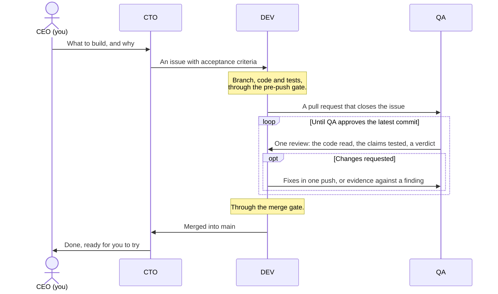

# agent-squad

**You, the human, are the CEO of a small software team of Claude Code agents.** You decide what
gets built. A CTO turns your ideas into a plan, a developer writes the code, and a QA reviews every
change. The team works the way a good team does, and comes to you when a decision is yours.

The agents run on **Claude Code** and coordinate on **GitHub**: issues hold the work to do, pull
requests carry each change and its review, and milestones show how far along each goal is.
agent-squad needs both.


### ✅ Features

- **A team with clear roles:**
  - 👨🏻‍💼 **CEO, you.** You decide what to build and why, and you only need to talk to the CTO. The
    agents write to you in your language, and to each other in English.
  - 👷🏼‍♂️ **CTO.** Your partner on the product. It talks through with you what to build, helps you
    shape the vision and choose the stack, and plans the work as GitHub issues. It settles any
    disagreement between DEV and QA, and brings you the decisions that are yours, as options with a
    recommendation.
  - 👨🏼‍💻 **DEV.** Writes the code and its tests, and opens a pull request for each issue.
  - 👩🏼‍🔬 **QA.** Reviews every pull request in two ways: it reads the code, and it tests what the
    pull request says it does.
- **A team that coordinates itself.** Each agent works in its own git worktree, a separate copy of
  the project, so nobody touches another's files. They message each other and follow the work on
  GitHub, without you in the middle.
- **Rules that scripts enforce.** Before every push, your project's checks must pass, and nothing
  goes straight to `main`. Before every merge, QA must have approved the latest commit, every
  comment must be settled, and CI must be green; `SQUAD.md` §4.9 has the details.
- **A clean install.** Everything lives in a `.agent-squad/` folder that git ignores. The installer
  never overwrites your files, and `--check` tells you whether the installation works.
- **Sessions that keep the thread.** Each session loads the rules when it starts, and a session
  whose context gets compacted is handed back the state of the project.
- **Versioned.** A project installs a release and upgrades when it chooses.


### ▶️ Quick start

You need Claude Code, a GitHub repository for your project, and the GitHub CLI (`gh`) logged in
([Requirements](#-requirements) has the details).

1. **Install the squad.** In your project's folder, run:

   ```bash
   gh api -H 'Accept: application/vnd.github.raw' repos/gzurl/agent-squad/contents/install.sh | bash
   ```

   It installs the latest release and tells you what it did. It ends with a short *By hand* list:
   leave that to the CTO, who deals with it in step 3.

2. **Start three Claude Code sessions** in that same folder, each in its own terminal, named after
   its role and your project (replace `<project-name>`):

   ```bash
   claude -n "CTO:<project-name>"
   claude -n "DEV:<project-name>"
   claude -n "QA:<project-name>"
   ```

3. **Tell the CTO:** *"Follow `.agent-squad/playbook/BOOTSTRAP.md`."* It asks which language to
   use with you, finishes setting up the repository, asks you what it needs to know, and then asks
   what you want to build.


## 📔 Contents

- [💡 Why agent-squad](#-why-agent-squad)
- [🔭 Overview](#-overview)
  - [Built on Claude Code and GitHub](#built-on-claude-code-and-github)
  - [How the team works](#how-the-team-works)
- [📋 Requirements](#-requirements)
- [🛠️ Install](#️-install)
- [🗂️ What goes where](#️-what-goes-where)
- [⚠️ Things to know](#️-things-to-know)
- [📦 This repository](#-this-repository)
- [📄 License](#-license)


## 💡 Why agent-squad

I built agent-squad for myself. For several months I tried different ways of working with Claude
Code agents on real projects, and this is the one that fits me best: I decide what to build and
why, and the team does the rest, with reviews I can trust.

Put several Claude Code sessions on one project without a method and they soon get in each other's
way. They edit the same files, forget what they agreed once their context is compacted, merge work
nobody reviewed, and push straight to `main`. Every rule in [SQUAD.md](SQUAD.md) comes from
something like that, and records the incident that led to it. The rules that matter most are
enforced by scripts, because good intentions alone do not keep them.

The method keeps changing as it is used: when an agent finds a flaw in it, the fix comes back here
as a new release, and [CHANGELOG.md](CHANGELOG.md) says what each release changed.


## 🔭 Overview

### Built on Claude Code and GitHub

**Claude Code runs the agents.** Each agent is a Claude Code session named after its role and the
project: `CTO:<project-name>`, `DEV:<project-name>` and `QA:<project-name>`. All three start in the
project's main folder, which lets them share Claude Code's memory, and each works in a worktree of
its own under `.agent-squad/worktrees/`. They send each other messages. Every session loads the
charter through `AGENTS.md`, and hooks save the project's state before Claude Code compacts a
session and hand it back afterwards.

**GitHub holds the work.** Issues are the backlog, grouped into milestones; pull requests carry the
changes, and reviews carry QA's verdicts. While setting up, the CTO creates a set of labels the
agents coordinate with: who owns an issue (CTO, DEV or QA), its type and priority, and its status
(in progress, in review, approved or blocked). One more label, `needs-ceo`, marks what is waiting
for you, so filtering by it gives you your inbox. The agents usually share one GitHub account, so
they sign everything they write. Before a merge, a script asks GitHub, through `gh`, whether the
pull request is really ready.

### How the team works



The CTO also writes pull requests of its own, reviewed by QA the same way, and settles any
disagreement between an author and QA. Every rule, with the incident that led to it, is in
[SQUAD.md](SQUAD.md); the merge gate's exact conditions are in its §4.9.
[BOOTSTRAP.md](BOOTSTRAP.md) is the CTO's one-time setup of a project.


## 📋 Requirements

- **Claude Code**, with the three sessions on the same machine.
- **A GitHub repository** for your project.
- **The GitHub CLI, `gh`**, logged in with the `repo` and `workflow` scopes and with access to
  `gzurl/agent-squad`, which is private for now.
- **bash**, **git** 2.31 or later, **jq** and **tar**.

Before it touches anything, the installer checks that `gh`, git, jq and tar are there, and that
`gh` is logged in and can read `gzurl/agent-squad`. If something is missing, it stops and says
what; it does not install anything for you.


## 🛠️ Install

In your project's main checkout (the folder you cloned, not a worktree), run:

```bash
gh api -H 'Accept: application/vnd.github.raw' repos/gzurl/agent-squad/contents/install.sh | bash
```

That installs the latest release. To pick a version (v15 or later) or another folder, add them
after `bash -s --`:

```bash
gh api -H 'Accept: application/vnd.github.raw' repos/gzurl/agent-squad/contents/install.sh \
  | bash -s -- --tag v20 /path/to/project
```

**To upgrade, run the same line again.** Then let the agents know: a running session keeps the
rules it loaded until it restarts or is compacted. [CHANGELOG.md](CHANGELOG.md) says what each
version changes.

The installer can run as often as you like, and it never overwrites or deletes a file your project
owns. It puts the release in `.agent-squad/playbook/`, adds its hooks to
`.claude/settings.local.json` and two lines to `.gitignore`, installs a small pre-push hook,
creates the DEV and QA worktrees, and adds GitHub issue and pull request templates if the project
has none. It prints every step, and ends with a *By hand* list of what it leaves to the CTO, who
takes care of it while following `BOOTSTRAP.md`:

- the *Squad* section of `AGENTS.md`, which loads the charter into every session (the installer
  prints it);
- `CLAUDE.md` as a symlink to `AGENTS.md`;
- `.agent-squad-checks`, the commands your CI runs, one per line: until it lists one, the pre-push
  gate refuses every push;
- the files the installer changed that belong in git, which reach `main` through a pull request
  like everything else.

To check the installation at any time, from the same folder:

```bash
.agent-squad/playbook/scripts/squad-install.sh --check .
```

It changes nothing. It prints one line per item, `check: ok` or `check: FAILED` with the reason,
exits with 1 if any item failed, and proves that the pre-push gate really refuses a failing check.
Right after installing, the items on the *By hand* list fail until the CTO completes them. In a
brand-new repository with no commits, so do the worktrees and the default branch: the installer
sets both when it runs again after the first commit.


## 🗂️ What goes where

Everything the squad installs or generates lives in `.agent-squad/`, which git ignores. Outside it,
the installer touches only the files listed before it:

```
<project>/
├── AGENTS.md, CLAUDE.md → AGENTS.md   in git    your conventions, and the charter's import
├── .agent-squad-checks                in git    the checks the pre-push gate runs
├── .gitignore                         in git    ignores .agent-squad/ and the local settings
├── .github/                           in git    issue and PR templates, only if you had none
├── .claude/settings.local.json        ignored   the squad's four hooks, next to your settings
├── .git/hooks/pre-push                in .git   runs the pre-push gate, after any hook you had
└── .agent-squad/                      ignored
    ├── playbook/          the installed release: charter, scripts, templates
    ├── worktrees/         dev/ and qa/, plus one cto-<topic>/ per pull request of the CTO
    ├── handoff/           the snapshot saved before each compaction
    ├── evidence/          the files QA's reviews rely on
    ├── install.log        one line per install or upgrade
    └── playbook.manifest  the checksums that --check compares the playbook against
```

An upgrade replaces `playbook/`, only once the new one is complete, and rewrites the hooks, the
pre-push hook and `playbook.manifest`; it leaves the rest alone. `SQUAD.md` §2.4 says who cleans up
what, and when.


## ⚠️ Things to know

- **Nothing goes straight to `main`.** The pre-push gate refuses it. When you approve an exception
  on an issue, the agent pushes it with `SQUAD_MAIN_EXCEPTION=#<issue> git push …`.
- **Some tools ignore `.gitignore`**, and from the main checkout they walk into
  `.agent-squad/worktrees/`, where the other agents' copies of the project live: `grep -r`, some IDE
  indexers and bundlers. Test runners and type checkers skip hidden folders unless configured
  otherwise (pytest and mypy do). Point such tools at the project's own paths; `rg` and ruff
  respect `.gitignore`.
- **`git worktree remove` refuses a worktree with modified or untracked files**, though ignored
  files do not stop it. `git -C <worktree> status` shows what is in the way: commit it, or discard
  it once you are sure it is not needed, and only then use `--force`.
- **Never run `git clean -d` with `-x` or `-X` in the main checkout.** It deletes the playbook, the
  snapshots, the evidence and `.claude/settings.local.json`, and with `-ff` the worktrees too.
- **`gh issue list --label` silently returns nothing** for a label whose emoji is made of several
  characters, as the owner labels and `needs-ceo` are. Filter on GitHub's web page, or with
  `gh issue list --json labels` and `jq`.


## 📦 This repository

| Path | What it is | Installed in a project? |
|---|---|---|
| `install.sh` | The one-line installer: it downloads a release and runs that release's installer | Run from `main`, not installed |
| `SQUAD.md`, `BOOTSTRAP.md`, `README.md` | The charter, the CTO's one-time setup, and this guide | Yes |
| `scripts/squad-*.sh`, `.githooks/pre-push` | The installer, the compaction hooks, the merge gate, the checks runner and the pre-push gate | Yes |
| `.github/ISSUE_TEMPLATE/`, `.github/PULL_REQUEST_TEMPLATE.md`, `templates/` | Templates the CTO starts from | Yes; the installer copies the GitHub ones when missing |
| `CHANGELOG.md` | What each version changes | Yes, to read |
| `LICENSE` | The MIT License | Yes, so every installed playbook carries it |
| `.gitattributes` | What a release leaves out | Yes, unused there |
| `AGENTS.md`, `CLAUDE.md`, `.gitignore`, `.agent-squad-checks`, `.github/workflows/`, `scripts/check-*.sh` | This repository's own conventions, checks, CI and tests | No: a release leaves them out, so a project's agents never load this repository's `CLAUDE.md` |


## 📄 License

agent-squad is released under the [MIT License](LICENSE): use it, change it and share it freely,
keeping the copyright notice. If it shapes how your team works, a link back is appreciated.
