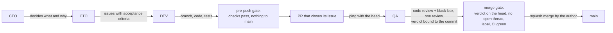

# agent-squad

**agent-squad** is the working method of a three-agent software team (a **CTO**, a **DEV** and a
**QA**, each a Claude Code session) directed by a human **CEO**, on GitHub.

It is built for **Claude Code** and **GitHub** and relies on both. The charter (`SQUAD.md`) holds
the rules and the incident behind each one; this repository versions them and installs them into
projects, without touching what the project owns.


### ✅ Features

- **Clear roles:** the CEO decides what and why; the CTO turns it into issues; DEV writes code and
  tests; QA reviews every PR in two parts, code review and black-box tests.
- **Gates enforced by scripts, not by memory:** before every push (the project's checks must pass,
  and nothing is pushed to `main`) and before every merge (an approved verdict bound to the head,
  no open thread, CI green, and a warning when `main` has moved under the PR).
- **A clean install:** everything lives in a git-ignored `.agent-squad/`; the installer never
  overwrites a project file, and `--check` proves the installation works.
- **Sessions that keep their bearings:** every session loads the charter by itself, and a
  compacted session gets back the objective state of the project.
- **Versioned upstream:** projects install a tag and upgrade when their CTO decides.


### ▶️ Quick start

```bash
tmp=$(mktemp -d)
gh api repos/gzurl/agent-squad/tarball/v16 | tar -xz -C "$tmp" --strip-components=1
"$tmp/scripts/squad-install.sh" /path/to/project v16
rm -rf "$tmp"
```

Then do what the installer lists under *By hand*, run `--check`, launch the three sessions from
the project's main checkout, and tell the CTO to follow `.agent-squad/playbook/BOOTSTRAP.md`.
[Install](#️-install) has the details.


## 📔 Contents

- [🔭 Overview](#-overview)
  - [Built for Claude Code and GitHub](#built-for-claude-code-and-github)
  - [How the team works](#how-the-team-works)
- [📋 Requirements](#-requirements)
- [🛠️ Install](#️-install)
- [🗂️ What goes where](#️-what-goes-where)
- [⬆️ Upgrade](#️-upgrade)
- [⚠️ Things to know](#️-things-to-know)
- [📦 This repository](#-this-repository)
- [🔄 How it evolves](#-how-it-evolves)


## 🔭 Overview

### Built for Claude Code and GitHub

| | Claude Code | GitHub |
|---|---|---|
| **Who works** | One session per role, named `CTO:<project>`, `DEV:<project>`, `QA:<project>`, launched from the project's main checkout | One account, usually shared by the three agents (`AGENTS.md` says which); signatures and labels tell them apart |
| **How they talk** | Messages between sessions | Issues, PRs, reviews and comments: the durable record |
| **What they follow** | `AGENTS.md` imports the charter into every session with an `@` import | The charter's rules for issues, labels, PRs and merges |
| **What keeps them on track** | Hooks: a snapshot before each compaction, re-injected after it | The merge gate reads verdicts, threads, labels and CI through `gh` |

### How the team works



Every rule, and the incident that motivated it, is in `SQUAD.md`. `BOOTSTRAP.md` is the CTO's
one-time setup of a project.


## 📋 Requirements

- **Claude Code**, with the three sessions launched from the project's main checkout, on one
  machine.
- **A GitHub repository**, and `gh` authenticated with the `repo` and `workflow` scopes and with
  access to `gzurl/agent-squad`, which is private.
- **bash**, **git** 2.31 or later, and **jq**.
- **Branch protection** needs a paid plan or a public repository. Without it, the pre-push gate
  still refuses pushes to `main`, the other gates hold by discipline, and `AGENTS.md` says so.


## 🛠️ Install

From anywhere, with the tag to install and the path of the project's main checkout:

```bash
tmp=$(mktemp -d)
gh api repos/gzurl/agent-squad/tarball/v16 | tar -xz -C "$tmp" --strip-components=1
"$tmp/scripts/squad-install.sh" /path/to/project v16
rm -rf "$tmp"
```

The installer is idempotent and never overwrites or deletes a file the project owns. It prints
every action it takes or skips and, under *By hand*, what it leaves to you, including the squad's
tracked files that `git status` shows as not yet committed, whichever run wrote them:

- **The *Squad* section of `AGENTS.md`**, which imports the charter into every session (the
  installer prints it, from `templates/AGENTS.md`).
- **`CLAUDE.md` as a symlink to `AGENTS.md`.**
- **`.agent-squad-checks`**, the list of commands the pre-push gate runs: the ones your CI runs,
  one per line. Until it lists one, the gate refuses every push.
- **The tracked files the installer changed** (`.gitignore`, and the GitHub templates when it
  created them), to commit.

All of it reaches `main` through one PR. The main checkout stays on `main`, so write it in a
worktree, `git -C /path/to/project worktree add .agent-squad/worktrees/cto-squad -b chore/squad origin/main`,
copy there the tracked files the installer changed, and open the PR from it; remove the worktree
after the merge. Then clear the installer's changes in the main checkout before pulling, or
`git pull --ff-only` refuses to overwrite them: `git checkout -- <file>` for each tracked file it
modified, and delete each file it created.

Then verify the installation:

```bash
"/path/to/project/.agent-squad/playbook/scripts/squad-install.sh" --check /path/to/project
```

It changes nothing and prints the installed version and the last `install.log` entry, then one
line per item (`check: ok` or `check: FAILED  <item>: <reason>`), and exits 1 if any failed. It
also proves that the gate really refuses a failing check, and says which branch the gate protects:
the remote's default one, as git records it in `origin/HEAD`, which the installer sets when it is
missing. Right after installing, only the items the installer leaves to you fail, plus the
worktrees in an empty repository: run the installer again once the default branch has a commit. Launch the three sessions from the main checkout and tell the
CTO to follow `.agent-squad/playbook/BOOTSTRAP.md`.


## 🗂️ What goes where

Everything the squad installs or generates lives in `<project>/.agent-squad/`, which git ignores.
Outside it, the installer only touches the files listed after it.

```
<project>/
├── AGENTS.md, CLAUDE.md → AGENTS.md   in git     the project's conventions + the charter import
├── .agent-squad-checks                 in git     the project's checks
└── .agent-squad/                       ignored
    ├── playbook/                                  the installed tag: charter, scripts, templates
    ├── worktrees/                                 dev/, qa/, cto-<topic>/
    ├── handoff/                                   snapshots saved before each compaction
    └── evidence/                                  what QA's reviews rely on
```

| Path (from the project's main checkout) | What it holds | Written by | In git | On upgrade | Removed when |
|---|---|---|---|---|---|
| `.agent-squad/playbook/` | The installed `agent-squad` tag, as GitHub's tarball of it: `SQUAD.md`, `BOOTSTRAP.md`, this README, `CHANGELOG.md`, `scripts/`, `.githooks/` (the gate the shim runs), the `.github/` templates, `templates/`, and `.gitattributes` | Installer | No | Replaced whole, only once the new one is complete | Never; reinstall to restore it |
| `.agent-squad/playbook/scripts/` | The compaction hooks' script, the merge gate, the checks runner, the installer | Installer | No | Replaced with the playbook | — |
| `.agent-squad/worktrees/dev/`, `qa/` | DEV's and QA's checkouts (git worktrees) | Installer creates; DEV and QA work there | No | Untouched | Persistent |
| `.agent-squad/worktrees/cto-<topic>/` | The CTO's checkout for one PR | CTO | No | Untouched | After its PR merges |
| `.agent-squad/handoff/` | One snapshot per session, saved before each compaction | Compaction hooks | No | Untouched | When stale, by anyone |
| `.agent-squad/evidence/<pr-or-issue>/` | Screenshots and files a review relies on | QA | No | Untouched | When its PR or issue closes |
| `.agent-squad/install.log` | One line per install or upgrade: date, old tag, new tag | Installer | No | Appended | Never |
| `.agent-squad/playbook.manifest` | The playbook's checksums as installed; `--check` compares against it | Installer | No | Rewritten | Never |
| `.agent-squad-checks` | The project's checks for the pre-push gate | The project | **Yes** | Untouched | — |
| `AGENTS.md`, `CLAUDE.md` → `AGENTS.md` | The project's conventions and the *Squad* section | The project | **Yes** | Untouched | — |
| `.claude/settings.local.json` | The squad's four hooks (compaction save and restore, and the start-up check that the charter is installed), next to Claude Code's own local settings | Installer merges ours, keeps the rest | No | Our entries rewritten | — |
| `.gitignore` | Two lines: `.agent-squad/` and `.claude/settings.local.json` | Installer appends when missing | **Yes** | Re-added if missing | — |
| `.github/ISSUE_TEMPLATE/task.md`, `.github/PULL_REQUEST_TEMPLATE.md` | Issue and PR templates | Installer only if missing; then the project | **Yes** | Re-created if missing | — |
| `.git/hooks/pre-push` | A shim that runs the playbook's gate and refuses the push if it is missing | Installer | No | Rewritten | — |
| `.git/hooks/pre-push.local` | The project's previous `pre-push`, if it had one; the shim runs it first | Installer moves it | No | Untouched | — |


## ⬆️ Upgrade

Run the installed installer with the new tag:

```bash
"/path/to/project/.agent-squad/playbook/scripts/squad-install.sh" /path/to/project v16
```

It replaces `playbook/` only once the new one is complete, rewrites `playbook.manifest`, appends
to `install.log` and leaves the rest of `.agent-squad/` alone. Tell the agents, who re-read the
changed sections: a running session keeps the charter it loaded until it restarts or compacts.
`CHANGELOG.md` says what each version changes.

From v16 on, the pre-push gate refuses any push to `main`: OpenSpec minutes go through a PR like
everything else, and an exception approved by the CEO on an issue is pushed with
`SQUAD_MAIN_EXCEPTION=#<issue> git push …`.

### From v15

Besides running the installer, a project on v15 does three things by hand, in one PR:
1. **The PR template.** The installer never overwrites a project's templates, so copy
   `.agent-squad/playbook/.github/PULL_REQUEST_TEMPLATE.md` over yours if yours is the one an
   earlier install created: v16 asks a PR to announce numbered claims.
2. **`main`'s protection.** Remove any GitHub bypass left for `openspec/`.
3. **`AGENTS.md`.** Update its line on `main`'s protection as `templates/AGENTS.md` now words it,
   and send OpenSpec minutes through PRs.

### From v14

Up to v14 a project carried the method as tracked copies. Moving to v15 or later takes one PR
and an announced stop:

1. **Stop.** Announce it. DEV and QA leave their worktrees clean, with their shells in the main
   checkout; the CTO's ephemeral worktrees are merged and removed first. Download the new tag as
   in [Install](#️-install), into `$tmp`: step 2 takes the *Squad* section from
   `$tmp/templates/AGENTS.md`, and step 3 runs `$tmp/scripts/squad-install.sh`.
2. **One PR, from a CTO worktree** in the v14 layout (`../<repo>.worktrees/cto-squad/`, removed
   after the merge):
   - `git rm SQUAD.md BOOTSTRAP.md scripts/squad-handoff.sh scripts/squad-merge-gate.sh scripts/squad-checks.sh .githooks/pre-push`;
   - `git mv .squad/checks .agent-squad-checks`;
   - remove the squad's hooks from `.claude/settings.json` (the whole file, if they are all it holds);
   - in `.gitignore`, replace `.claude/handoff/` and `evidence/`, with their comments, by
     `.agent-squad/` and `.claude/settings.local.json`;
   - in `AGENTS.md`, add the *Squad* section of `templates/AGENTS.md`, update the directories,
     point every reference to the removed files (the introduction, *Compact instructions*, the
     README) at `.agent-squad/playbook/`, and every reference to `.squad/checks` at
     `.agent-squad-checks`.

   Its push runs no gate, because `core.hooksPath` points at the `.githooks/` it removes: run the
   checks by hand and say so in the PR.
3. **After the merge, in the main checkout:** `git pull --ff-only`; delete `.claude/handoff/`;
   `git config --unset core.hooksPath`; `mkdir -p .agent-squad/worktrees`;
   `git worktree move ../<repo>.worktrees/dev .agent-squad/worktrees/dev`, and the same for `qa`.
   In each moved worktree, delete any environment that stores absolute paths (a Python virtualenv:
   `rm -rf .venv`, then recreate it, e.g. `uv sync`). From the main checkout, move any evidence
   QA left in its worktree: `mv .agent-squad/worktrees/qa/evidence/* .agent-squad/evidence/`
   (create the target first). Then run the installer and `--check`.
4. **Open branches:** a branch started on v14 has no `.agent-squad-checks`, so the gate refuses
   it. DEV merges `main` into every open branch before its next push; QA rests on
   `git switch --detach origin/main`.
5. **Relaunch the three sessions** from the main checkout and tell DEV and QA their new
   directories: a session started on v14 keeps v14's hooks, which call the removed
   `scripts/squad-handoff.sh` and would save no snapshot and inject no re-orientation.


## ⚠️ Things to know

- **Tools that do not honour `.gitignore`** walk into `.agent-squad/worktrees/` from the main
  checkout and see the other agents' copies of the project: `grep -r`, some IDE indexers and
  bundlers. Test runners and type checkers skip dot-directories by default (pytest and mypy do),
  and are affected only when configured to enter them, for instance pytest with `norecursedirs`
  overridden. Restrict such tools to the project's paths; `rg` and ruff honour `.gitignore`.
- **Never run `git clean -d` with `-x` or `-X` in the main checkout:** it deletes the playbook, the
  snapshots, the evidence and `.claude/settings.local.json` (with `-ff`, the worktrees too).
- **`gh issue list --label` returns nothing, silently,** for a label whose emoji is a sequence of
  several characters, as the owner labels and `needs-ceo` are. Filter on GitHub's web page, or with
  `gh issue list --json labels` and `jq`.
- **Tooling traps:** `gh api --slurp` cannot be combined with `--jq` (pipe into `jq` instead);
  `addPullRequestReviewThreadReply` takes a `pullRequestReviewThreadId`; `jq` takes one variable
  name per `--arg`; zsh does not word-split unquoted variables, so multi-file loops belong in bash.


## 📦 This repository

| Path | What | Used from `playbook/` in a project? |
|---|---|---|
| `SQUAD.md`, `BOOTSTRAP.md`, `README.md` | Charter, one-time setup, this guide | Yes |
| `scripts/squad-*.sh`, `.githooks/pre-push` | Installer, compaction hooks, merge gate, checks runner, gate | Yes |
| `.github/ISSUE_TEMPLATE/`, `.github/PULL_REQUEST_TEMPLATE.md`, `templates/` | Templates and skeletons the CTO starts from | Yes; the installer copies the GitHub ones when missing |
| `CHANGELOG.md` | What each version changes | Yes, to read |
| `AGENTS.md`, `CLAUDE.md`, `.claude/`, `.gitignore`, `.agent-squad-checks`, `.github/workflows/`, `scripts/check-*.sh` | This repository's own conventions, Claude Code settings, checks, CI and tests | No: `.gitattributes` keeps them out of the tag's tarball, so a project's agent never loads this repository's `CLAUDE.md` |


## 🔄 How it evolves

Upstream first (`SQUAD.md`, section 7): any agent who finds a flaw or an improvement in the method
opens an issue **here**, with the incident that motivated it; this repository's CTO owns the PRs,
reviewed with the same protocol. Versions are tags `vN` matching the `Version:` line of
`SQUAD.md`; `CHANGELOG.md` says what each one changes. A project upgrades when its CTO decides.
