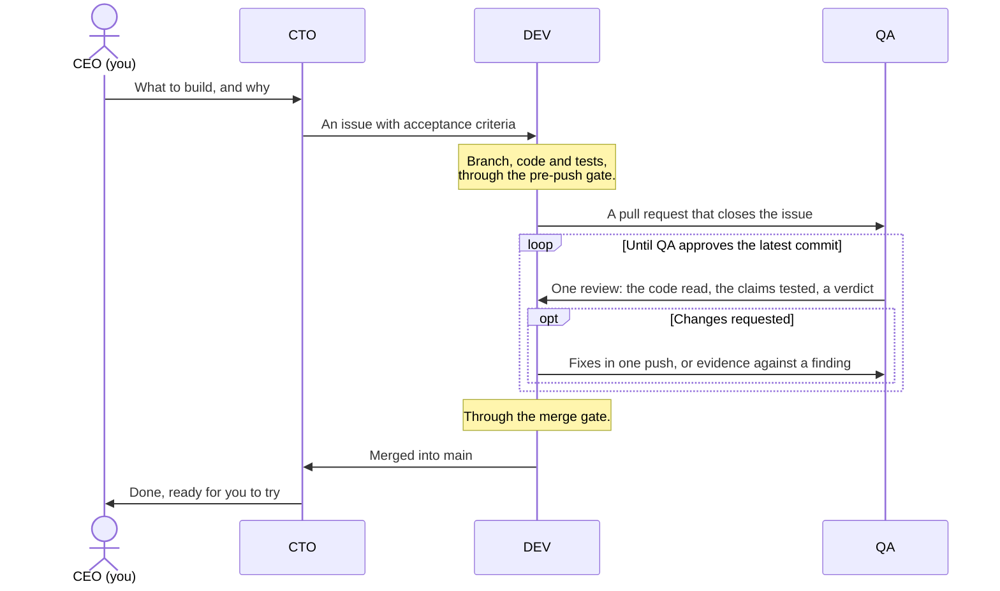

# agent-squad

**You, the human, are the CEO of a small software team of Claude Code agents.** You decide what
gets built. A CTO turns your ideas into a plan, a developer writes the code, and a QA reviews every
change. The team works the way a good team does, and comes to you when a decision is yours.

The agents run on **Claude Code** and coordinate on **GitHub**: issues hold the work to do, pull
requests carry each change and its review, and milestones show how far along each goal is.
agent-squad needs both.


### ✅ Features

- **A team with clear roles:**
  - 👨🏻‍💼 **CEO, you.** You decide what to build and why, and you only need to talk to the CTO. The
    agents write to you in your language, and to each other in English.
  - 👷🏼‍♂️ **CTO.** Your partner on the product. It talks through with you what to build, helps you
    shape the vision and choose the stack, and plans the work as GitHub issues. It settles any
    disagreement between DEV and QA, and brings you the decisions that are yours, as options with a
    recommendation.
  - 👨🏼‍💻 **DEV.** Writes the code and its tests, and opens a pull request for each issue.
  - 👩🏼‍🔬 **QA.** Reviews every pull request in two ways: it reads the code, and it tests what the
    pull request says it does.
- **A team that coordinates itself.** Each agent works in its own git worktree, a separate copy of
  the project, so nobody touches another's files. They message each other and follow the work on
  GitHub, without you in the middle.
- **Rules that scripts enforce.** Before every push, your project's checks must pass, and nothing
  goes straight to `main`. Before every merge, QA must have approved the latest commit, every
  comment must be settled, and CI must be green; `SQUAD.md` §4.9 has the details.
- **A clean install.** Everything lives in a `.agent-squad/` folder that git ignores. The installer
  never overwrites your files, and `--check` tells you whether the installation works.
- **Sessions that keep the thread.** Each session loads the rules when it starts, and a session
  whose context gets compacted is handed back the state of the project
  ([how](#when-a-sessions-context-fills-up)).
- **Versioned.** A project installs a release and upgrades when it chooses
  ([how](#-upgrade)).


### ▶️ Quick start

You need Claude Code, a GitHub repository for your project, and the GitHub CLI (`gh`) logged in
([Requirements](#-requirements) has the details).

1. **Install the squad.** In your project's folder, run:

   ```bash
   gh api -H 'Accept: application/vnd.github.raw' repos/gzurl/agent-squad/contents/install.sh | bash
   ```

   It installs the latest release and tells you what it did. It ends with a short *By hand* list:
   leave that to the CTO, who deals with it in step 3.

2. **Start three Claude Code sessions** in that same folder, each in its own terminal, named after
   its role and your project (replace `<project-name>`):

   ```bash
   claude -n "CTO:<project-name>"
   claude -n "DEV:<project-name>"
   claude -n "QA:<project-name>"
   ```

3. **Tell the CTO:** *"Follow `.agent-squad/playbook/BOOTSTRAP.md`."* It asks which language to
   use with you, finishes setting up the repository, asks you what it needs to know, and then asks
   what you want to build.


## 📔 Contents

- [💡 Why agent-squad](#-why-agent-squad)
- [🔭 Overview](#-overview)
  - [Built on Claude Code and GitHub](#built-on-claude-code-and-github)
  - [How the team works](#how-the-team-works)
  - [When a session's context fills up](#when-a-sessions-context-fills-up)
  - [When you step away](#when-you-step-away)
  - [How many tokens the agents use](#how-many-tokens-the-agents-use)
- [📋 Requirements](#-requirements)
- [🛠️ Install](#️-install)
- [🔄 Upgrade](#-upgrade)
- [🗂️ What goes where](#️-what-goes-where)
- [⚠️ Things to know](#️-things-to-know)
- [📦 This repository](#-this-repository)
- [📄 License](#-license)


## 💡 Why agent-squad

I have been programming since I was seven (oh boy, those wonderful years of BASIC and assembler on
an 8-bit ZX Spectrum!), and I have been a software engineer since 2003. I have to admit that
generative AI has changed the way we build software forever; whether for better or for worse, time
will tell. First, GitHub Copilot seemed to guess the next block of code I was about to write. Then
ChatGPT gave me valuable snippets I could paste into my IDE. But the real explosion came in the
spring of 2025, when I started using Claude Code, and my relationship with programming changed
radically. The first versions felt like a sharp intern, then like a junior engineer, and in the end
it wrote code better and faster than any human I know. Writing code stopped being my main value as
an engineer. I had to raise the level where I add value: organising the AI's work, knowing what has
to be done, when is the right moment to do it and why (weighing the pros, the cons and the expected
value), and arranging the work so that it gets done as effectively as possible. It also meant
learning to talk to the AI efficiently, and to ask for things in a way that gets me what I want.
That sounds obvious, but there is a particular way of talking to an AI: it is less about being
strict with words and grammar than about what to include and what to leave out, which is probably
where prompt engineering came from.

With Claude Code I went through several stages: a single session in the terminal, then desktop
interfaces, then back to the terminal (iTerm2, then tmux, Ghostty, and finally cmux, for its agent
integration). Like almost everyone, I then tried several agents on the same repository, each on its
own feature, and ran into the conflicts between them and the extra friction of using and managing
Git worktrees. Several tools appeared to automate that, but I felt I was not getting all the juice
that coding agents could give me.

So, to be more effective, I moved to a two-role layout: a developer and a QA engineer. One builds,
the other verifies. QA works from a different context, which keeps it from fooling itself, as the
developer would. That worked for a while, until I noticed how much of my time went into carrying
one agent's decisions, plus my own feedback, to the other. The `SendMessage` tool, which lets
sessions message each other, took me out of the middle (I was no longer the bottleneck man in the
middle). The next rock in the road was quality: on a given feature, the two could not agree on
whether the work was good enough (the famous P2s and P3s of one model reviewing another), and they
would get stuck in a pointless loop that only burned tokens. That brought the last step up: DEV and
QA needed a boss, and not me, but an AI-agent CTO.

That is how agent-squad's three-agent model was born. I play the CEO, or product manager, of a
small team: a CTO, a developer and a QA. I only talk to the CTO, about vision, product, software
stack, architecture and so on. Together we set the project's direction, and the CTO deals with the
rest of the team and settles their disagreements. Each member works in its own local worktree, and
the work lives on GitHub: its issues and pull requests are the single source of truth, where I, as
the CEO, can step in whenever I want.

Every rule in [SQUAD.md](SQUAD.md) comes from something that went wrong on a real project, and the
rules that matter most are enforced by scripts, because good intentions alone do not keep them. The
method keeps changing as it is used: when an agent finds a flaw in it, the fix comes back here as a
new release, and [CHANGELOG.md](CHANGELOG.md) says what each release changed.

agent-squad is my own, very personal take on how to build software today with Git, GitHub and
Claude Code. I am sure it has plenty of flaws and limits, which is why I am making it public, for
anyone who wants to lend a hand and contribute.


## 🔭 Overview

### Built on Claude Code and GitHub

**Claude Code runs the agents.** Each agent is a Claude Code session named after its role and the
project: `CTO:<project-name>`, `DEV:<project-name>` and `QA:<project-name>`. All three start in the
project's main folder, which lets them share Claude Code's memory, and each works in a worktree of
its own under `.agent-squad/worktrees/`. They send each other messages. Every session loads the
charter through `AGENTS.md`, and hooks save the project's state before Claude Code compacts a
session and hand it back afterwards. A session you resume, after updating Claude Code for instance,
starts again in the main folder, and a hook reminds its agent which folder each agent works in.

**GitHub holds the work.** Issues are the backlog, grouped into milestones; pull requests carry the
changes, and reviews carry QA's verdicts. While setting up, the CTO creates a set of labels the
agents coordinate with: who owns an issue (CTO, DEV or QA), its type and priority, and its status
(in progress, in review, approved or blocked). One more label, `needs-ceo`, marks what is waiting
for you, so filtering by it gives you your inbox. The agents usually share one GitHub account, so
they sign everything they write. Before a merge, a script asks GitHub, through `gh`, whether the
pull request is really ready.

### How the team works



The CTO also writes pull requests of its own, reviewed by QA the same way, and settles any
disagreement between an author and QA. Every rule, with the incident that led to it, is in
[SQUAD.md](SQUAD.md); the merge gate's exact conditions are in its §4.9.
[BOOTSTRAP.md](BOOTSTRAP.md) is the CTO's one-time setup of a project.

### When a session's context fills up

A Claude Code session has a limited context. When it fills up, Claude Code compacts it: it replaces
the conversation with a summary, and whatever the summary leaves out is gone. Left to itself, an
agent can come back from a compaction without knowing which pull request it was reviewing, or what
it had promised another agent. agent-squad guards against that in three ways:

1. **It steers the summary.** `AGENTS.md` has a *Compact instructions* section that tells Claude
   Code what every summary must keep: the agent's role, the issue and pull request it is working
   on, the latest commit and verdict, the exact step it had reached, and anything it promised
   another agent.
2. **It saves the facts and hands them back.** Just before any compaction, manual or automatic, a
   hook saves a snapshot of the project's state in `.agent-squad/handoff/`: the worktrees, the open
   pull requests with their labels and verdicts, the issues in progress, in review or blocked, and
   the latest commits on the main branch. When the session resumes, another hook hands the
   snapshot back, with instructions to re-read the rules and the issue before doing anything else.
3. **It keeps the real memory on GitHub.** Each agent leaves a short comment on its issue at every
   step, and long runs write a `progress.log`. What is written there survives any compaction; what
   was only in the agent's head may not.

**What you can do:** `/context` shows how full a session's context is. When a session passes about
80%, type `/squad-save-state` in it: its agent writes its state on its issue and tells you when it
is ready. Then type `/compact`. If you type `/compact` without `/squad-save-state` right before it,
a hook stops the compaction and reminds you; a second `/compact` within ten minutes goes ahead
anyway. A compaction you choose, at a quiet moment, loses less than one that Claude Code triggers
in the middle of a task, which no hook can stop.

### When you step away

One command tells the squad you are leaving, or that you are back. The CTO passes it on to DEV
and QA, and answers you once for the three. Typed in DEV's or QA's session, it applies to that
agent alone.

| Type&nbsp;in&nbsp;the&nbsp;CTO's&nbsp;session | When | What happens |
|---|---|---|
| ⏸️&nbsp;`/squad-pause` | You need everything stopped at a safe point: to close the laptop, to use the machine for something else, or for any other reason | Each agent finishes what it is doing, saves where it is on GitHub, and stops. The CTO tells you when it is safe. |
| ⏩&nbsp;`/squad-away` | You leave, and the machine stays on | The agents carry on with whatever needs no decision from you, and leave those decisions on GitHub for when you are back. |
| ▶️&nbsp;`/squad-resume` | You are back | The CTO sums up what was done, what waits for you, and the plan ahead. Paused agents pick up where they stopped. |

Nothing notifies you while you are away: `/squad-resume` tells you what happened, and the issues
labelled `needs-ceo` are your inbox.

Whenever the CTO reports on the agents, during these commands or when you ask how they are doing,
each agent gets a line of its own, always in the order CTO, DEV, QA, with an emoji for its state:
working, paused, free, waiting for you, or no answer. The same lines come back in every update, so
you see at a glance who is still busy.

**Several squads on the machine?** Add `-all`: `/squad-pause-all`, `/squad-away-all` and
`/squad-resume-all`, typed in any squad's CTO session, do the same for every squad, and you get one
answer, grouped by squad, that names any squad that did not answer.

A session that is waiting for you in its own terminal, on a question or a permission prompt,
cannot act on a command until you answer it there: the CTO tells you which one, and passes the
command to the rest of its squad. A command that reaches an agent late is checked with whoever sent
it before anyone acts on it.

### How many tokens the agents use

Type `/squad-usage` in any of the squad's sessions to see how many tokens each agent of the project
has used: its input, the share of that input read from the cache, its output, and the models it ran
on. `/squad-usage 30d` covers the last 30 days, and `/squad-usage 2026-09-24` starts on that day.
`/squad-usage-all` reports every project on the machine, one block per project, and asks no other
squad: it reads every session's figures itself.

The figures come from the transcripts Claude Code keeps on your machine, which it deletes about 30
days after a session was last used. Each report also adds them to a history in
`.agent-squad/tokens.tsv`, so they outlive the transcripts. Nothing leaves the machine. Tokens are
not cost: most of the input is read from the cache, which is billed far below fresh input.


## 📋 Requirements

- **Claude Code**, with the three sessions on the same machine.
- **A GitHub repository** for your project.
- **The GitHub CLI, `gh`**, logged in with the `repo` and `workflow` scopes and with access to
  `gzurl/agent-squad`, which is private for now.
- **bash**, **git** 2.31 or later, **jq** and **tar**.

Before it touches anything, the installer checks that `gh`, git, jq and tar are there, and that
`gh` is logged in and can read `gzurl/agent-squad`. If something is missing, it stops and says
what; it does not install anything for you.


## 🛠️ Install

In your project's main checkout (the folder you cloned, not a worktree), run:

```bash
gh api -H 'Accept: application/vnd.github.raw' repos/gzurl/agent-squad/contents/install.sh | bash
```

That installs the latest release. To pick a version or another folder, add them
after `bash -s --`:

```bash
gh api -H 'Accept: application/vnd.github.raw' repos/gzurl/agent-squad/contents/install.sh \
  | bash -s -- --tag v31 /path/to/project
```

To upgrade later, see [Upgrade](#-upgrade).

The installer can run as often as you like, and it never overwrites or deletes a file your project
owns. It puts the release in `.agent-squad/playbook/`, adds its hooks to
`.claude/settings.local.json`, writes the squad's commands (`/squad-save-state`, `/squad-pause`,
`/squad-away`, `/squad-resume`, `/squad-upgrade`, and the three `-all` ones) into
`.claude/commands/`, adds three lines to `.gitignore`, installs a small pre-push hook, creates the
DEV and QA worktrees, and adds GitHub issue and pull request templates if the project has none. It
prints every step, and ends with a *By hand* list of what it leaves to the CTO, who takes care of it
while following `BOOTSTRAP.md`:

- the *Squad* section of `AGENTS.md`, which loads the charter into every session (the installer
  prints it);
- `CLAUDE.md` as a symlink to `AGENTS.md`;
- `.agent-squad-checks`, the commands your CI runs, one per line: until it lists one, the pre-push
  gate refuses every push;
- the files the installer changed that belong in git, which reach `main` through a pull request
  like everything else.

To check the installation at any time, from the same folder:

```bash
.agent-squad/playbook/scripts/squad-install.sh --check .
```

It changes nothing. It prints one line per item, `check: ok` or `check: FAILED` with the reason,
exits with 1 if any item failed, and proves that the pre-push gate really refuses a failing check.
Right after installing, the items on the *By hand* list fail until the CTO completes them. In a
brand-new repository with no commits, so do the worktrees and the default branch: the installer
sets both when it runs again after the first commit.


## 🔄 Upgrade

When a new release is out, type `/squad-upgrade` in the CTO's session. The CTO tells you which
release the project runs, what the new one changes and whether you need to do anything, and
installs it only when you say yes. The agents then re-read the rules that changed, so there is
nothing else for you to do; the CTO asks you to compact the sessions only after a release that
rewrites much of the charter. The release notes are in [CHANGELOG.md](CHANGELOG.md).


## 🗂️ What goes where

Everything the squad installs or generates lives in `.agent-squad/`, which git ignores. Outside it,
the installer touches only the files listed before it:

```
<project>/
├── AGENTS.md, CLAUDE.md → AGENTS.md      in git    your conventions, and the charter's import
├── .agent-squad-checks                   in git    the checks the pre-push gate runs
├── .gitignore                            in git    ignores .agent-squad/, the local settings, the commands
├── .github/                              in git    issue and PR templates, only if you had none
├── .claude/settings.local.json           ignored   the squad's five hooks, next to your settings
├── .claude/commands/squad-*.md           ignored   the squad's ten commands
├── .git/hooks/pre-push                   in .git   runs the pre-push gate, after any hook you had
└── .agent-squad/                         ignored
    ├── playbook/          the installed release: charter, scripts, templates
    ├── worktrees/         dev/ and qa/, plus one cto-<topic>/ per pull request of the CTO
    ├── handoff/           the snapshot saved before each compaction
    ├── evidence/          the files QA's reviews rely on
    ├── install.log        one line per install or upgrade
    ├── tokens.tsv         the history of the tokens each agent used, kept by /squad-usage
    └── playbook.manifest  the checksums that --check compares the playbook against
```

An upgrade replaces `playbook/`, only once the new one is complete, and rewrites the hooks, the
pre-push hook and `playbook.manifest`; it leaves the rest alone. `SQUAD.md` §2.4 says who cleans up
what, and when.


## ⚠️ Things to know

- **Nothing goes straight to `main`.** The pre-push gate refuses it. When you approve an exception
  on an issue, the agent pushes it with `SQUAD_MAIN_EXCEPTION=#<issue> git push …`.
- **Some tools walk into `.agent-squad/worktrees/`** from the main checkout, where the other
  agents' copies of the project live, and pick up their files: Jest and Metro do by default, and
  so do `grep -r` and some IDE indexers and bundlers. Exclude `.agent-squad/` in each tool's
  configuration with a pattern anchored at the project root: the worktrees live inside
  `.agent-squad/`, so an unanchored pattern also excludes a worktree's own files when the tool runs
  there. `templates/AGENTS.md` has the settings for common tools, and the CTO checks them while
  setting up. Leave `.agent-squad` out of Watchman's `ignore_dirs`: a worktree's watch reuses the
  main checkout's. TypeScript, pytest and mypy skip hidden folders by default, and `rg` and ruff
  respect `.gitignore`.
- **`git worktree remove` refuses a worktree with modified or untracked files**, though ignored
  files do not stop it. `git -C <worktree> status` shows what is in the way: commit it, or discard
  it once you are sure it is not needed, and only then use `--force`.
- **Never run `git clean -d` with `-x` or `-X` in the main checkout.** It deletes the playbook, the
  snapshots, the evidence and `.claude/settings.local.json`, and with `-ff` the worktrees too.
- **A project that uses Git LFS runs LFS's pre-push hook from `.git/hooks/pre-push.local`.** The
  squad's shim owns `.git/hooks/pre-push`, so `git lfs install` cannot add LFS's hook there, and a
  push would send pointers without their files. Put `git lfs pre-push "$@"` in an executable
  `.git/hooks/pre-push.local`, which the shim runs first. A project that had LFS's hook before the
  install already has it there. Files pushed before the hook was in place reached the remote as
  pointers: `git lfs push --all origin` uploads what the remote lacks. `--check` shows an item for
  it when a `.gitattributes` of the project has `filter=lfs`.
- **`gh issue list --label` silently returns nothing** for a label whose emoji is made of several
  characters, as the owner labels and `needs-ceo` are. Filter on GitHub's web page, or with
  `gh issue list --state open --limit 1000 --json number,title,labels` and `jq`; without
  `--limit`, the list stops at 30 issues.


## 📦 This repository

To report a problem or propose an idea, open an issue: [CONTRIBUTING.md](CONTRIBUTING.md) says how.
The squad turns accepted issues into its own pull requests.

| Path | What it is | Installed in a project? |
|---|---|---|
| `install.sh` | The one-line installer: it downloads a release and runs that release's installer | Run from `main`, not installed |
| `SQUAD.md`, `BOOTSTRAP.md`, `README.md` | The charter, the CTO's one-time setup, and this guide | Yes |
| `commands/squad-*.md` | The squad's commands: `/squad-save-state`, `/squad-pause`, `/squad-away`, `/squad-resume`, `/squad-upgrade`, `/squad-pause-all`, `/squad-away-all`, `/squad-resume-all`, `/squad-usage`, `/squad-usage-all` | Yes; the installer copies them into `.claude/commands/` |
| `scripts/squad-*.sh`, `.githooks/pre-push` | The installer, the session hooks, the merge gate, the checks runner, the token report and the pre-push gate | Yes |
| `.github/ISSUE_TEMPLATE/task.md`, `.github/PULL_REQUEST_TEMPLATE.md`, `templates/` | Templates the CTO starts from | Yes; the installer copies the GitHub ones when missing |
| `CHANGELOG.md` | What each version changes | Yes, to read |
| `LICENSE` | The MIT License | Yes, so every installed playbook carries it |
| `.gitattributes` | What a release leaves out | Yes, unused there |
| `AGENTS.md`, `CLAUDE.md`, `CONTRIBUTING.md`, `.github/ISSUE_TEMPLATE/outside-report.md`, `.gitignore`, `.agent-squad-checks`, `.github/workflows/`, `scripts/check-*.sh` | This repository's own conventions, contribution guide and form, checks, CI and tests | No: a release leaves them out, so a project's agents never load this repository's `CLAUDE.md` |


## 📄 License

agent-squad is released under the [MIT License](LICENSE): use it, change it and share it freely,
keeping the copyright notice and the license text with it. If it shapes how your team works, a link
back is appreciated.
